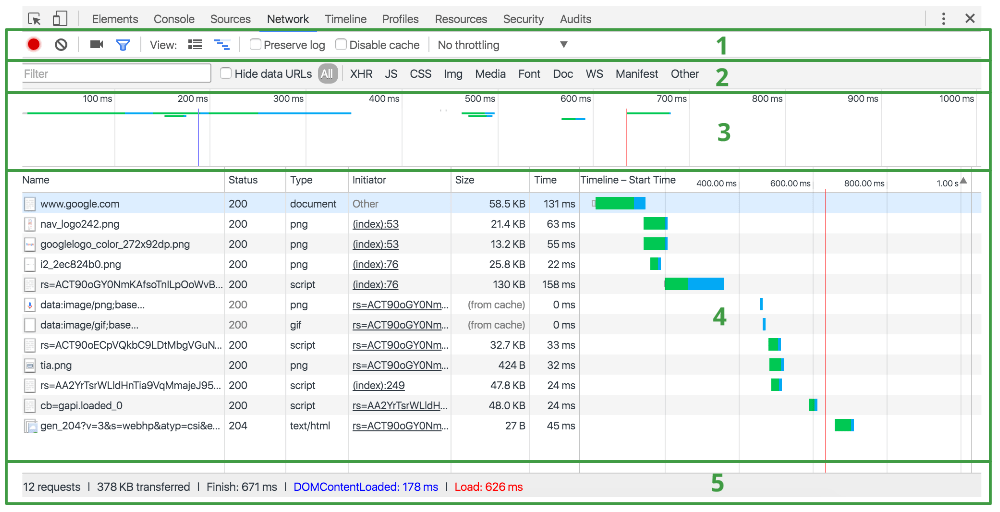
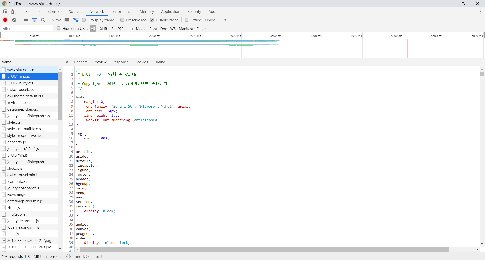
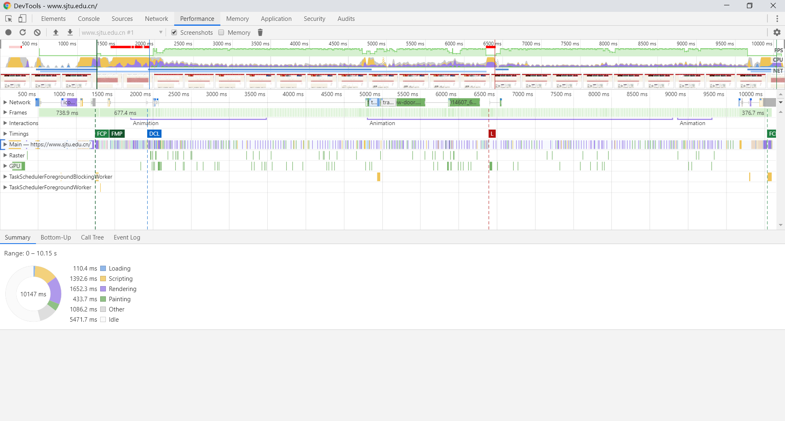

# F12(DevTools for Developers)

> F12是web开发中的重要生产和调试工具，可用来对网站进行迭代、调试和分析。本文将会以上海交通大学官方网站作为范例，简要描述一下F12的作用。因为在做web开发中最广泛使用的浏览器就是chrome浏览器，所以本文也会以此浏览器的devtools作为模板来说。
***

### 所有属性


上图为在官网按F12打开的devtools，我们将按照红线部分从左到右来做说明。

***
### 检查模式


我们通过在devtools最左边的那个小标签或者在页面中右键选择“检查”打开。其作用是将页面中的每个模块与Element中的代码块相对应，我们可以通过方法来查看我们想要检查的模块的对应代码以及相关的样式(在右侧框中查看style等)。具体的element相关的会在下面的部分中进行进行说明。

***
### 设备模式


> 使用 Device Mode 可以大致了解页面在移动设备上呈现的外观和效果，我们可以通过页面顶端的工具栏具体修改使用设备、画面比例，是否联网等属性。

从图中我们可以看出，交大官网做了移动端的自适应。

***
### 元素面板


> Elements面板检查和实时编辑页面的HTML与CSS。一般和检查方法一起使用。
- 在 Elements 面板中检查和实时编辑 DOM 树中的任何元素。
- 在 Styles 窗格中查看和更改应用到任何选定元素的 CSS 规则。
- 在 Computed 窗格中查看和修改选定元素的框模型。
- 在 Sources 面板中查看在本地对页面所做的更改。

具体的编辑方法是我们在双击想要修改的部分，然后就会出现上图的input框，我们可以按照我们的需求进行修改，接着按回车键，回到原页面就可以查看我们修改后的效果了，右边style等三个栏的方法修改也是相同的方法。

style主要用于查看对应的CSS的详细信息。


computed能够让我们很直观地查看DOM块的整体空间大小，我们以途中的这部分为例，在方形图中，我们能够发现很有趣的一点，就是这个块的margin左右大小设置为-15px，具体原因应该是与下面的动画有关。


Event Listener能够让我们在开发中方便的查看我们为某个模块写的click等方法有没有加载到其中。我们关注那个mouseover的方法，我们操作的话可以看到就是鼠标移上去图片会放大，在Event Listener中我们可以知道是来自jquery的一个动画方法，当然也是因为图片会放大，所以这个模块的margin设为了负数。

***
### 控制台面板

console面板可以说是我们web开发中非常常用的一个模块。

一方面，在做前后端对应的时候，我们经常做的就是
```javascript
console.log(response);
```
来查看后端给前端的response是什么样的结构以及是不是我们所需要的数据，能够很方便地debug。


另一方面，我们可以在浏览器的console中调用我们写在页面全局的函数，来运行查看对应的效果，对我们写代码很有帮助，如上图我们就可以通过sDate来查看浏览器获取到的现在的时间。

***

### 源代码面板

> source能够查看网站的源代码以及对应的引入的js等库文件，并且在源代码面板中可以设置断点来调试 JavaScript ，或者通过Workspaces（工作区）连接本地文件来使用开发者工具的实时编辑器。


如上图，左侧是在服务器上的文件夹层级的样式，在其中我们可以找到想要查看的文件以及其中的代码。中间部分就是代码的主要内容，从中我们可以看到，在交大主页中存在大量没有用的备注是的代码，虽然这部分不会被解析到页面中，但是作为一个已经发布的网站，这样的代码风格是不规范的。右侧是我们打断点调试的时候会显示的一些辅助信息。因为不分析交大页面的开发过程，这里便不在赘述了。

***

### 网络面板

> 使用网络面板能够了解请求和下载的资源文件并优化网页加载性能。



Network 面板由五个窗格组成：
- Controls。 使用这些选项可以控制 Network 面板的外观和功能。
- Filters。 使用这些选项可以控制在 Requests Table 中显示哪些资源。 提示：按住 Cmd (Mac) 或 Ctrl (Windows/Linux)，并点击过滤器可以同时选择多个过滤器。
- Overview. 此图表显示资源检索时间的时间线。 如果您看到多条竖线堆叠在一起，则说明这些资源被同时检索。
- Requests Table. 此表格列出了检索的每一个资源。 默认情况下，此表格按时间顺序排序，最早的资源在顶部。
点击资源的名称可以显示更多信息。 提示：右键点击 Timeline 以外的任何一个表格表头可以添加或移除信息列。 
- Summary。 此窗格可以一目了然地告诉您请求总数、传输的数据量和加载时间。

作为开发人员，我们关注的一般都是XHR里面的信息，也就是返回过来的页面json信息：


上图是上海交大官网的network页面情况，从overview中我们可以看到我们可以看到network总的请求加载时间为5.17s，然后我们再看一下返回的json文件，可以发现有"jzpp"等奇怪的key，这也是交大官网开发的不好的地方，返回的字符串用这种难以读懂的拼音字母作为key，代码风格很不好。



接着all中查看，发现没有csrf的token，那么官网就很难做跨网站请求攻击的防御，安全性不够好。

***
### 性能面板

> 使用时间轴面板可以通过记录和查看网站生命周期内发生的各种事件来提高页面的运行时性能。

Timeline 面板包含以下四个窗格：
- Controls。开始记录，停止记录和配置记录期间捕获的信息。
- Overview。 页面性能的高级汇总。更多内容请参见下文。
- 火焰图。 CPU 堆叠追踪的可视化。可以在火焰图上看到一到三条垂直的虚线。蓝线代表 DOMContentLoaded 事件。 绿线代表首次绘制的时间。 红线代表 load 事件。
- Details。选择事件后，此窗格会显示与该事件有关的更多信息。未选择事件时，此窗格会显示选定时间范围的相关信息。


对于交大官网的performance如下：



我们可以看到在summary中除了idle外，主要是脚本（黄色）和样式表（紫色，用于渲染页面），原因是交大页面中运用了很多好看的动画效果，所以增加了时间。


***
### 内存面板和应用面板
> 如果需要比时间轴面板提供的更多信息，可以使用“配置”面板，例如跟踪内存泄漏。
> 使用资源面板检查加载的所有资源，包括IndexedDB与Web SQL数据库，本地和会话存储，cookie，应用程序缓存，图像，字体和样式表

***
### 安全面板
> 使用安全面板调试混合内容问题，证书问题等等。


从这个面板可以看到，交大官网使用的是https证书，相对于其他很多网站用的http更为安全。

***
### 总结

优点：

1. 交大页面做了很多的动画效果，页面非常好看，而且各个DOM的组件结构做的做的也很好。
2. 交大使用的是https，有更高的安全性。
3. 做了移动端的自适应。

缺点：

1. 代码风格很需要改进，一方面是代码里存在大量无用的注释代码，另一方面，数据库等key的命名仍为拼音首字母命名。
2. 没有做csrf的防御措施。
3. 也是因为引用了大量的js文件，所以整个页面的加载时间相对有点长。