# Resource Consumption of REST Service

---

>- 性能检测工具：Prometheus
>- 压力测试工具：Jmeter

 1 - 没有Request时
 
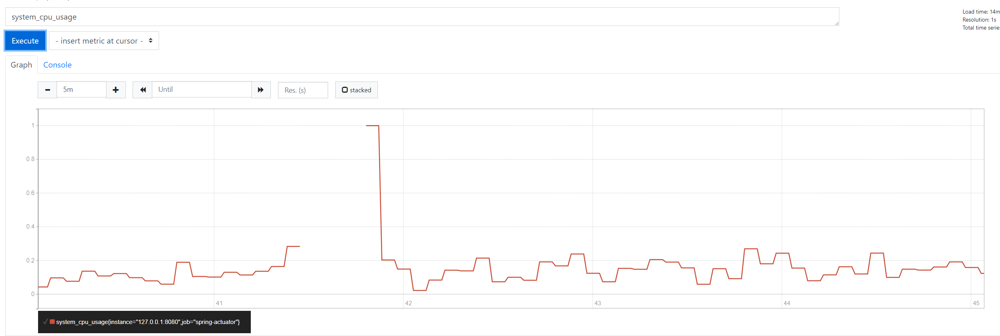

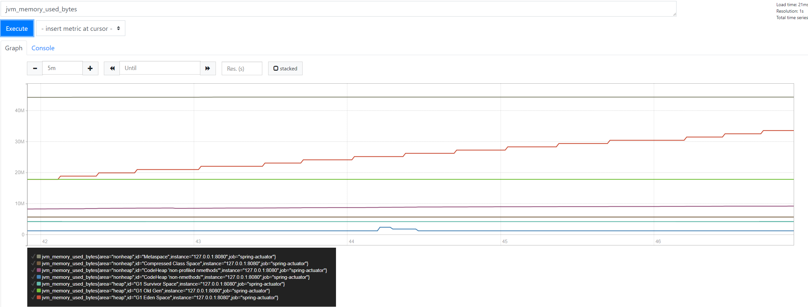

 2 -  1user/s  (total 60s)
 
 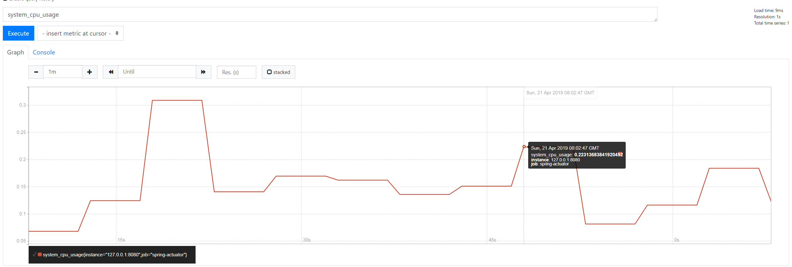
 
 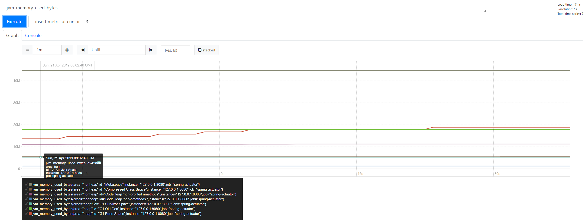
 
 3 - 5user/s    (total 60s)
 
  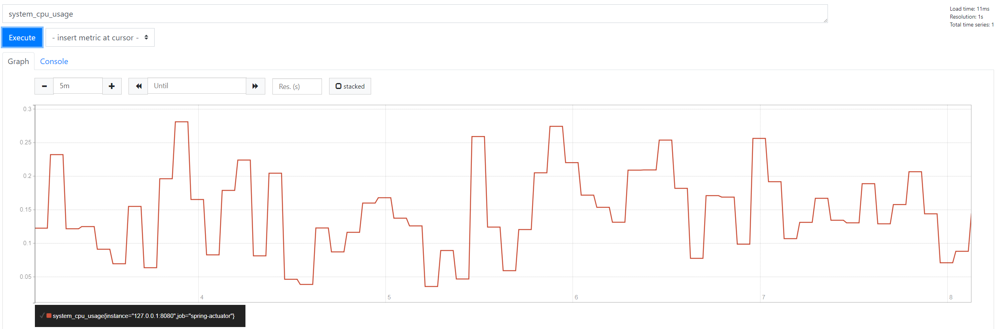
  
  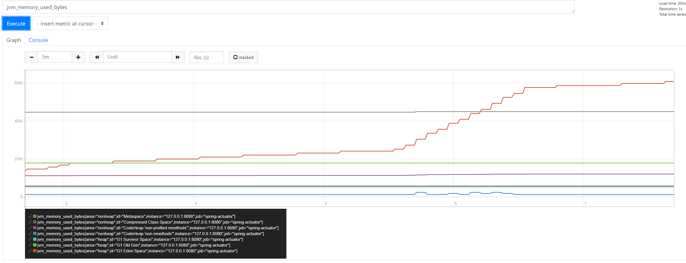
  
  4 - 10user/s  (total 60s)
   
  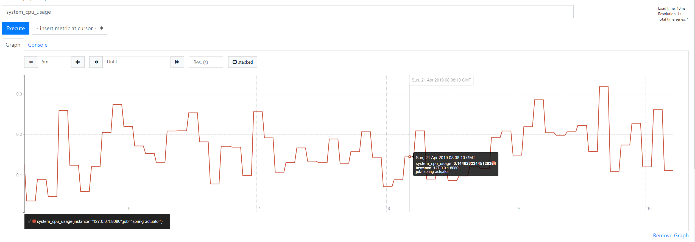
  
  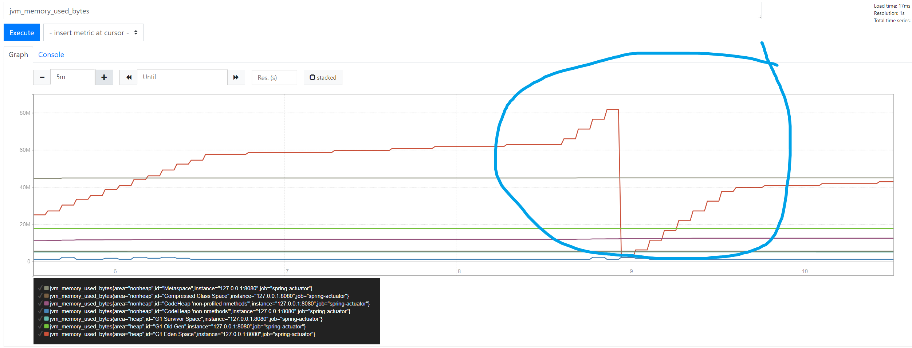
  
  5 - 50user/s  (total 60s)
  
  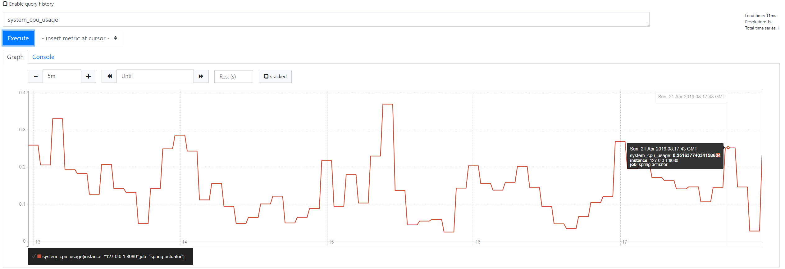
  
  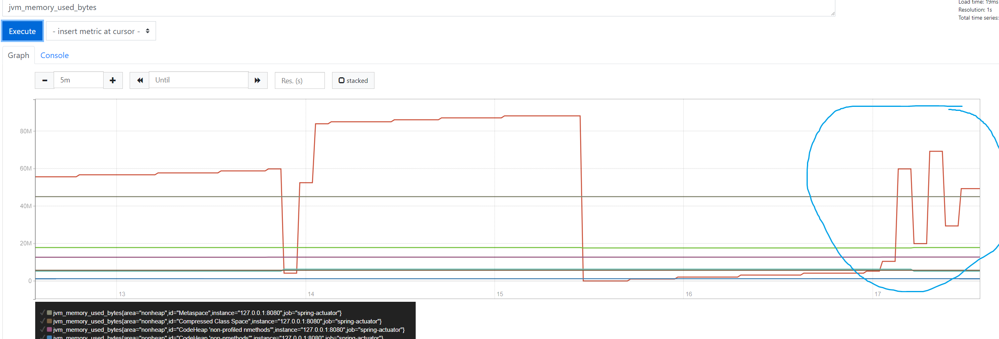
  
  
---

可以看到memory在request次数高的时候和平时的增长速度有较大的差别，增长速度明显比没有request时快，并且随着request的增多，增长速度更快。但是cpu没有很大的变化，可能是并发不够多，所以影响不大。

--

  6 - 1000user/s		(30s)
  
  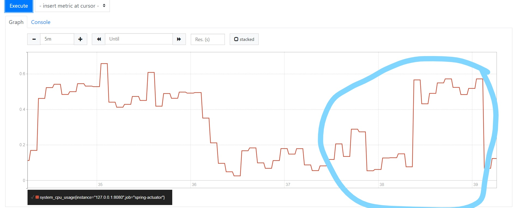
  
  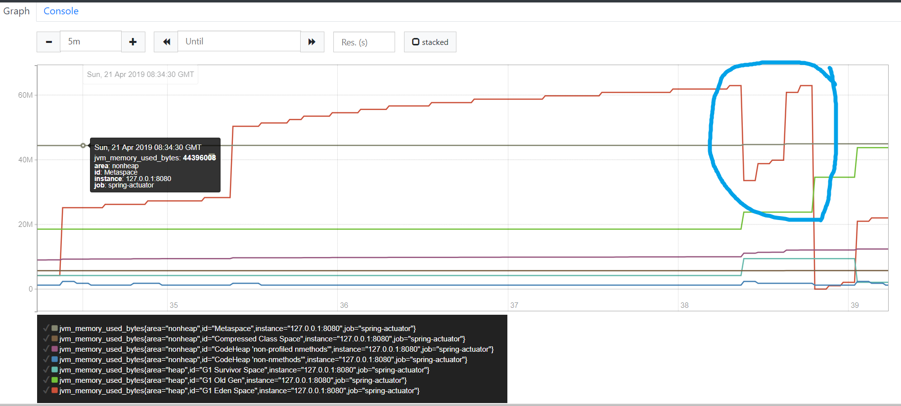
  
  7 - 10000user/s    (30s)
  
  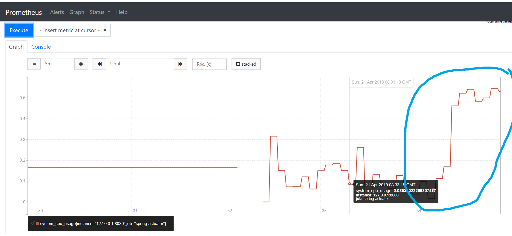
  
  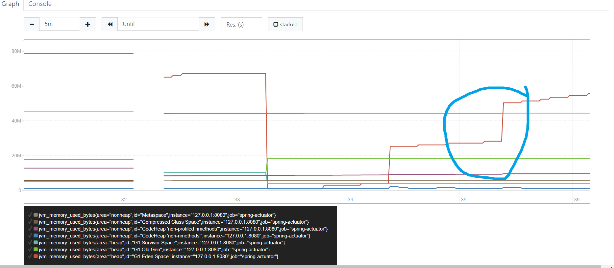
  
---
在高并发的情况下，cpu的占用率和memory的使用都有了很大的提高，但是由于我用jmeter告诉我threads不够了，所以个能上面的图只有不到20s的时间是在正常运行的，但是仍能看出随着request的增多，开始的时候资源占用情况不明显，随着request并发非常多，成为了cpu的主要占用部分，所以cpu占用率的增长也更加明显，但是由于不同机器的资源不同，所以cpu的分配也会有各自的上限，cpu占用达到上限之后便不会随着request的增加而增加，机器可能就会让没有发出的request处于等待阶段，之后再被处理。